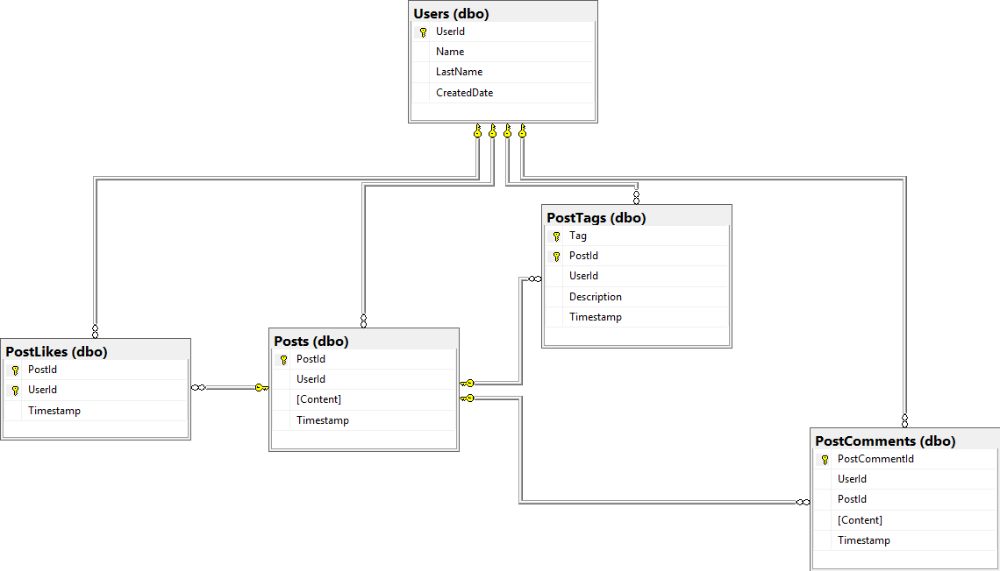

# Text Forum

The forum is a basic text system which has the capabilities to add posts, retrieve posts, and like posts. Management does not believe in users editing or deleting existing posts, for ethical reasons.

# Structure

.png>)

# Database Structure

