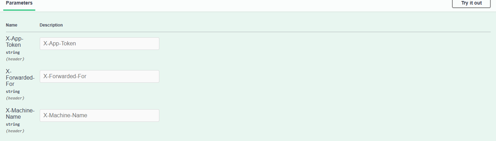

# Text Forum

The forum is a basic text system which has the capabilities to add posts, retrieve posts, and like posts. Management does not believe in users editing or deleting existing posts, for ethical reasons.

# Structure


# Database Structure


# Configuration (textforum.api appsettings.json)

```json
{
  "Logging": {
    "LogLevel": {
      "Default": "Information",
      "Microsoft.AspNetCore": "Warning"
    }
  },
  "AllowedHosts": "*",
  "ConnectionStrings": {
    "SQLConnection": "{your_sql_server_connection_string_with_read_and_write_permissions}"
  },
  "JwtKey": "{a_secure_key_for_creating_jwt_tokens}",
  "JwtIssuer": "{https://yourissuer.com}",
  "JwtAudience": "{https://youraudience.com}",
  "JwtExpiryInMinutes": "30",
  "ValidApps": {
    "Apps": {
      "{your_app_token}": {
        "IPAddresses": "{your_ips_comma_separated}",//example 192.168.1.1
        "MachineNames": "{your_machine_names_comma_separated}"
        //example MyAwesomeServer
      },
      "{another_app_token}": {
        "IPAddresses": "{your_ips_comma_separated}",//example 127.0.0.1,localhost
        "MachineNames": "{your_ips_comma_separated}"//example MyAwesomeLocalPC
      }
    }
  }

}

```

# API Explanation

.NET 8 Web Api.

Designed to work with multiple front ends, designed to be stateless. Uses JWT tokens for authentication and aothorization. Connection string needed since we are using a code first approach (The connection string creds need to allow write access as tables will be created by code). 

On first use a migration needs to be run to create the tables in database. 

# Migration Instructions

>[!Note]
> Please note that the latest version of Visual Studio with Package Manager Console needs to be used

Open Package Manager Console in Visual Studio

Change DefaultProject to textforum.data


Since a migration is checked in the following command can be run (please ensure that the textforum.api is set as your startup project and also that you have a valid connection string)
```
Update-Database
```

> [!NOTE]  
> If the migration is not created for some random reason please run the following command in Package Manager Console ```Add-Migration textforuminitial``` and then rerun the ```Update-Database``` command

# Running the textforum.api Application in Visual Studio

>[!Note]
> Please note that the latest version of Visual Studio with .NET 8 needs to be used

Trusting the instruction above to set textforum.api was followed you can just click the Start Debugging button otherwise just right click the project and Click Debug > Start New Instance 

Once the application runs please navigate add the following to end of URL to utilise swagger interface ```/swagger/index.html```

# API Authentication

The API has 2 levels of authentication namely, 
1. App Authentication (Which utilises a Token, Valid IP Addresses and Valid Machine Names passed in header) 
2. User Authentication (Which uses email and password to authenticate)

How do I authenticate?
## 1. App Authentication

Your config section for valid apps needs to be configured correctly, here is an example of a possible localhost config 

```json
"ValidApps": {
    "Apps": {
      "Kvb6MvwH1fWyJmyS4ZQfJwFbdzmAzkSMtLvqVbuft1JmJQeyGXIKAPcrVSCLOoMC": {
        "IPAddresses": "127.0.0.1,localhost",
        "MachineNames": "JOHNDOE,IID58795"
        //I can't predict your PC name 
        //but actually it doesn't matter put anything here but just be consistent
      }
    }
  }
```

In swagger interface when its asks for the headers please fill in correct value
1. X-App-Token: The token that serves as key in config
2. X-Forwarded-For: The IP address as is on your config
3. X-Machine-Name: The machine name as is on your config



## 2. User Authentication

> [!IMPORTANT]
> A pre-requisite for user authentication is User Registration which uses App Authentication to authenticate, reCAPTCHA is highly recommended on your app side as well
> 
> 

The endpoints for user authentication and authorisation (These endpoint are protected by app authentication):

### 1. GetUserToken
Given the email and password is correct, it will return a JWT token for that users interactions

### 2. Verify Token Validity

Check the token and return a true or false to indicate if token is still valid

Checks for expiry and tampering

### 3. GetClaims

Given the token it will return all the claims for that token

To authenticate user on endpoint that require user authentication please fill in the X-User-Token value which will be the JWT token returned by GetUserToken method


> [!NOTE]
> For the post tag add functionality a moderator user is required to be able to add tags
> To create a moderator table you will need to set the isModerator boolean to true on the database table and then authenticate the user so the ismoderator claim can be added to JWT token, a new token will be required
> 

# Important 

* Password security is the responsibility of the app utlising the API currently, will possibly add password requirements in version something.something...
* The headers for the App Authentication can be spoofed but the point was to just add more variables for security 
* The calling App needs to be responsible enough to use reCAPTCHA to avoid bot registrations
* For security reasons it would be best for the calling app to store token inside a secure cookie on the web side